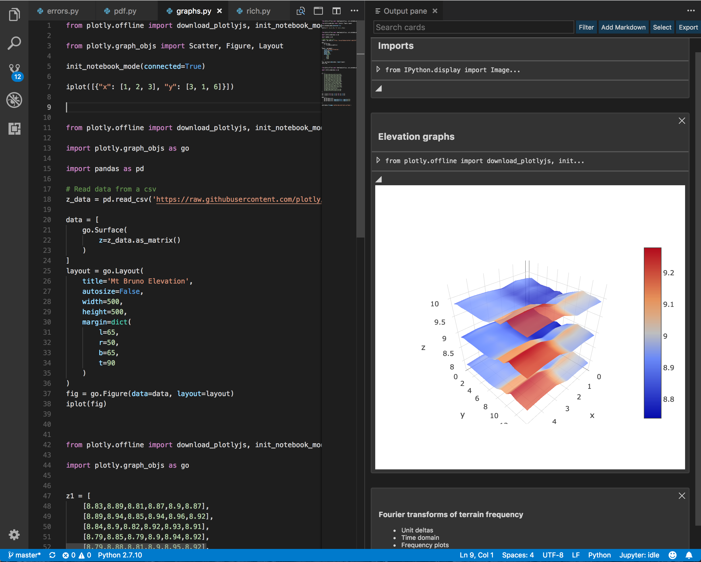

# neuron for Visual Studio Code

### An interactive programming experience for data scientists

**neuron** is a robust application that seamlessly combines the power of
Visual Studio Code with the interactivity of Jupyter Notebook.

## Getting started

Download the latest release from [the releases page](https://github.com/lorenzo2897/vscode-ipe/releases).

This extension makes available several commands starting with `IPE:` to control the behaviour.

To get started, open a Python or R file and run the `Show output pane` command (or click the icon in the top right corner). You will have the choice to create a new notebook or use an existing one (this is for development only, not a production feature).

To add a card, select some Python code and run the `Send code to output` command, or use the keyboard shortcut <kbd>alt</kbd>+<kbd>enter</kbd>.

## Requirements

* You must have at least Visual Studio Code version 1.23.0

## Release Notes

### 1.0.0

Initial release

For information about building upon this extension, visit [the guide for developers](DEVELOPING.md).
